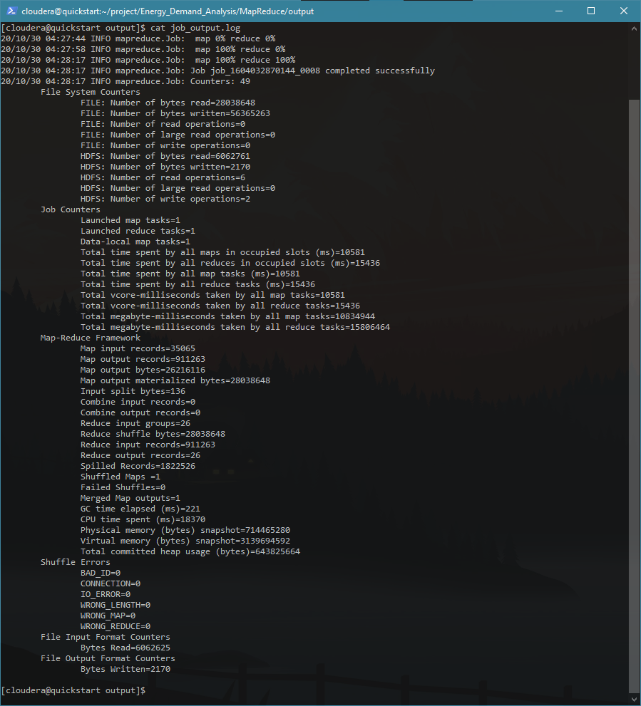
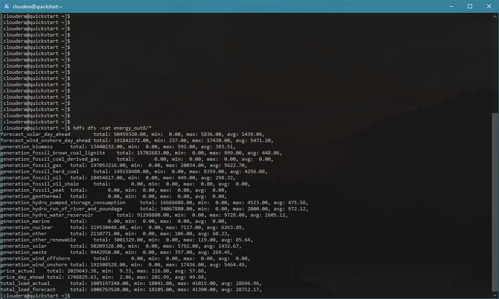
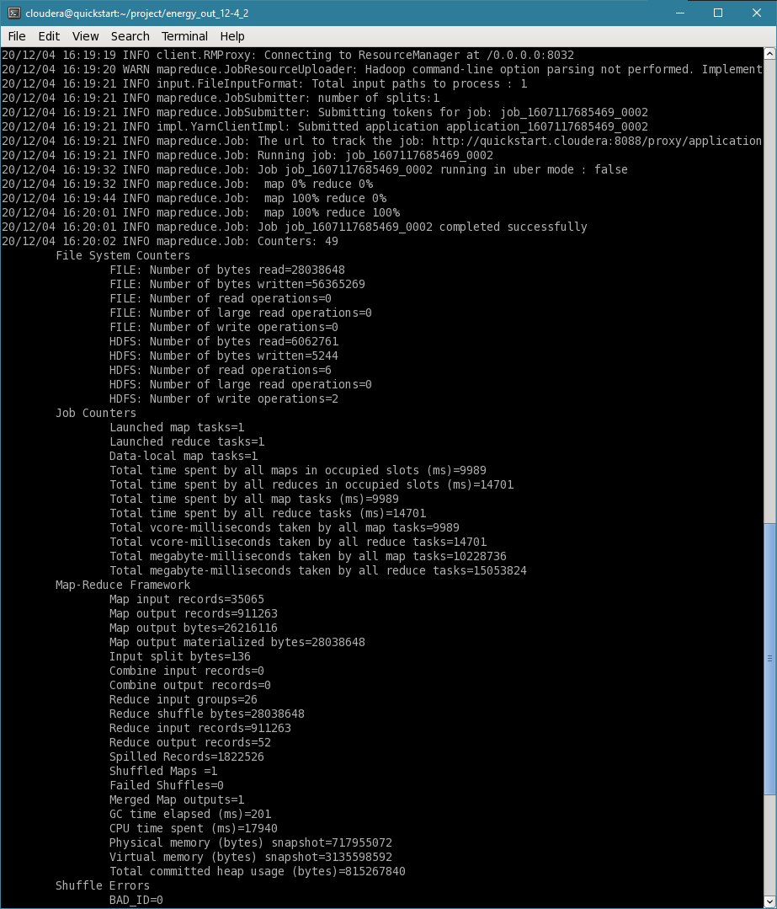
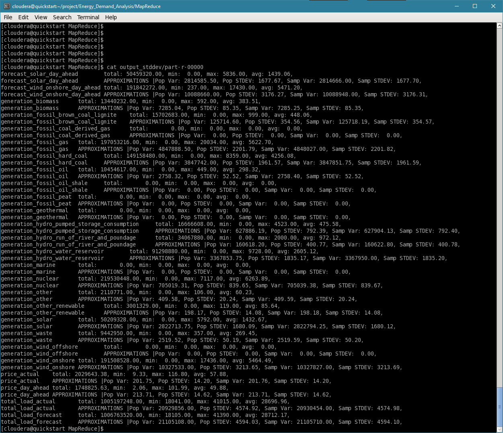

# MapReduce
[EnergyAnalysis/src/Statistics/Statistics.java](EnergyAnalysis/src/Statistics/Statistics.java): MapReduce setup and job coordinator .

[EnergyAnalysis/src/Statistics/Map.java](EnergyAnalysis/src/Statistics/Map.java): Mapper used to filter and split up the columns to send to the reducer

[EnergyAnalysis/src/Statistics/Reduce.java](EnergyAnalysis/src/Statistics/Reduce.java): Reducer used to calculate a few basic statistics

[output/job_output.log](output/job_output.log)

Understanding the output of your job is critical when debugging your MR program. My mapper records were way lower than I thought due to a logical error in my header detection. I would not have noticed this if I didn't read the job output and realize the mapper records out were lower than I expected.

[output/part-r-00000](output/part-r-00000)

Final output of the MapReduce job

## Scott Increment notes
Starting with the basics in MapReduce I wanted to get some descriptive statistics for each column in our dataset. Fortunately, our dataset makes this easy since nearly all the columns are of the same type. Since I only have one datatype to worry about, I can get away with creating only one reducer to find the mean, min, and max. Each row is split up by column and written to the reducer with the field name as the key. 

I wish to calculate a few more descriptive statistics, such as the median, quartiles, standard deviation, and variance but found them difficult to calculate due to the nature of MapReduce. I believe I can overcome a few of these limitations by using a secondary sort, changing the algorithm used to calculate the statistic or only calculating an approximation. 

In addition, I also want experiment with joining the weather dataset to start doing some complex grouping. A mapper-side join currently is not be possible without some preprocessing since the datasets are different lengths and some rows may be missing from the energy dataset.

## Final Increment notes

Final output of the MapReduce job

[output_stddev/part-r-00000](output_stddev/part-r-00000)

The typical way to calculate standard deviation requires two passes over a dataset and it does not work with a continuous data stream. In Hadoop map-reduce this is infeasible and inefficient. In order to overcome these limitations, you need a single pass algorithm that can handle a continuous stream of data. This is where Welford's method comes in. Welford's method calculates an approximation of the mean, variance, and standard deviation over time. With the ability to dynamically calculate the standard deviation we can better analyze our dataset and determine the effectiveness and reliability of our predictions.

## References

https://nestedsoftware.com/2018/03/27/calculating-standard-deviation-on-streaming-data-253l.23919.html

https://hadoop.apache.org/docs/r2.6.0/api/org/apache/hadoop/mapred/lib/ChainMapper.html

https://hadoop.apache.org/docs/r2.6.0/api/org/apache/hadoop/mapred/lib/ChainReducer.html

https://hadoop.apache.org/docs/r2.6.0/api/org/apache/hadoop/mapred/Mapper.html

https://hadoop.apache.org/docs/r2.6.0/api/org/apache/hadoop/mapred/Reducer.html

https://hadoop.apache.org/docs/r2.6.0/api/org/apache/hadoop/mapreduce/Job.html

https://hadoop.apache.org/docs/r2.6.0/api/org/apache/hadoop/io/package-summary.html

https://jonisalonen.com/2013/deriving-welfords-method-for-computing-variance/

